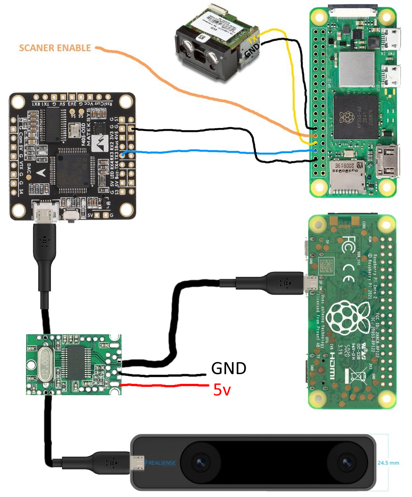

# Дрон инвентаризации

Работает в паре с ядром инвентаризации [@uvl-robotics/uvl-inventory-offboard-py](/uvl-inventory-offboard-py/README.md)

## Образ SD карты

Скачать образ можно по на [странице бинарных файлов](/uvl-binaries-and-images/README.md)  
Образ называется `uvl-inventory-offboard`.

## Сервисы

- `bt-scanner.service` - сервис подключения Bluetooth сканера
- `hacks.service` - сервис утилит: запускает wifi, открывает порт 80, вызывает sync 10 раз в секунду
- `offboard.service` - сервис ПО инвентаризации
- `offboard-box-counting.service` - сервис [ПО коробочного пересчёта](box-counting.md)
- `realsense.service` - сервис камеры стабилизации realsense

Для запуска ПО в режиме системы коробочного пересчёта необходимо включить минимум сервисы `hacks.service` и `offboard.service`, и сервис `copter_soft.service` из [@uvl-robotics/uvl-inventory-offboard-py](/uvl-inventory-offboard-py).

## Параметры

```ini
CAMERA_EN
COPTER_SOFT_EN
DRONE_ID
MAVLINK_SERIAL_BAUD
MAVLINK_SERIAL_PATH
MAVLINK_SYSTEM_ID
MAVLINK_UDP_EN
MAVLINK_UDP_HOST
MAVLINK_UDP_PORT
MINTT_HOST
MINTT_PORT
OSD_HEIGHT
OSD_PADDING_BOTTOM
OSD_PADDING_LEFT
OSD_PADDING_RIGHT
OSD_PADDING_TOP
OSD_SERIAL_BAUD
OSD_SERIAL_PATH
OSD_WIDTH
PHOTO_EXIF_ORIENTATION
PHOTO_HEIGHT
PHOTO_WIDTH
RC_ALLEY_NEXT_PWM
RC_ALLEY_PREV_PWM
RC_ALLEY_SWITCH_CH
RC_EMPTY_CH
RC_EMPTY_PWM
RC_NO_TAG_CH
RC_NO_TAG_PWM
RC_PHOTO_CH
RC_PHOTO_PWM
RC_RESCAN_CH
RC_RESCAN_PWM
RC_SCANOFF_CH
RC_SCANOFF_PWM
RC_UNREADABLE_CH
RC_UNREADABLE_PWM
SCANNER_SERIAL_BAUD
SCANNER_SERIAL_PATH
SCANNER_SERIAL_RECONNECT_TIMEOUT
WAREHOUSE_FILE
WAREHOUSE_LOADED_ALLEY_FILE
WAREHOUSE_RESULTS_DIR
WAREHOUSE_RESULTS_TAR_SERVER_PORT
```

## Сборка

### Версия без Realsense


### Версия с Realsense



## Настройка OSD

Для работы полетного контроллера `Mateksys H743-Wing/SLIM/MINI/WLITE` необходима
[прошивка с поддержкой OSD](./hex/2023-08-15%20arducopter_with_bl.hex).

Для отрисовки OSD необходимо в параметрах полетного контроллера прописать
протокол `42` и бадрейт `115200` последовательного порта `X` на который подключена
разбери и включить элемент `UIOSD`

```ini
SERIALX_BAUD,115
SERIALX_PROTOCOL,42

OSD1_UIOSD_EN,1
OSD1_UIOSD_X,0
OSD1_UIOSD_Y,0
```

## Настройка Realsense камеры

Есть два варианта настройки камеры позиционирования:

|EKF|Ссылка|
|-|-|
|EK2|[https://ardupilot.org/dev/docs/ros-vio-tracking-camera.html](https://ardupilot.org/dev/docs/ros-vio-tracking-camera.html)|
|EK3|[https://ardupilot.org/copter/docs/common-vio-tracking-camera.html](https://ardupilot.org/copter/docs/common-vio-tracking-camera.html)|

> На текущий момент по результатам тестов используется система на EK2,  
> как более стабильная, но EK3 не отключается

Для использования Realsense камеры необходимо в параметрах полетного
контроллера прописать следуюшие вещи


```ini

# тип камеры realsense, ориентации и позиция на дроне по x,y,z

VISO_TYPE,2
VISO_ORIENT,24
VISO_POS_X,0.085
VISO_POS_Y,0.01
VISO_POS_Z,-0.075

# параметры мат модели визуальной навигации

VISO_SCALE,1
VISO_DELAY_MS,0
VISO_POS_M_NSE,0.1
VISO_VEL_M_NSE,0.1
VISO_YAW_M_NSE,0.1

# настройки EKF для полета по камере

AHRS_EKF_TYPE,2

EK2_ENABLE,1
EK2_VELNE_M_NSE,0.1
EK2_VELD_M_NSE,0.1
EK2_POSNE_M_NSE,0.1
EK3_ABIAS_P_NSE,0.003

EK3_ENABLE,1
EK3_SRC1_POSXY,6
EK3_SRC1_VELXY,6
EK3_SRC1_VELZ,6
EK3_SRC1_YAW,6

# отключить компас и GPS

GPS_TYPE,0
COMPASS_ENABLE,0
COMPASS_USE,0
COMPASS_USE2,0
COMPASS_USE3,0

# повышенная чувствительность высотомера

RNGFND_FILT,0.25

# затянутые параметы, чтобы дрон не был бешеным

PILOT_SPEED_UP,50
PILOT_ACCEL_Z,50
PILOT_Y_RATE,90
PILOT_SPEED_DN,50
FHLD_BRAKE_RATE,15
WPNAV_SPEED,600
WPNAV_RADIUS,500
WPNAV_SPEED_UP,50
WPNAV_SPEED_DN,50
WPNAV_ACCEL,100
WPNAV_ACCEL_Z,300
LOIT_SPEED,500
LOIT_ACC_MAX,100
LOIT_BRK_JERK,2000
LOIT_BRK_DELAY,0
ANGLE_MAX,2000
PHLD_BRAKE_RATE,10
```