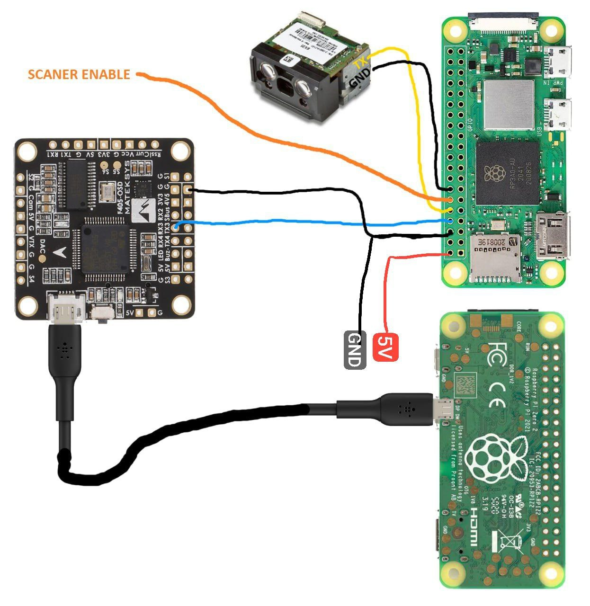

# Дрон инвентаризации

Работает в паре с ядром инвентаризации [@uvl-robotics/uvl-inventory-offboard-py](/uvl-inventory-offboard-py/README.md)

## Образ SD карты

Скачать образ можно по на [странице бинарных файлов](/uvl-binaries-and-images/README.md)  
Образ называется `uvl-inventory-offboard`.

## Сервисы

- `bt-scanner.service` - сервис подключения Bluetooth сканера
- `hacks.service` - сервис утилит: запускает wifi, открывает порт 80, вызывает sync 10 раз в секунду
- `offboard.service` - сервис ПО инвентаризации

Для запуска ПО необходимо включить минимум сервисы `hacks.service` и `offboard.service`.

## Параметры

```ini
CAMERA_EN
DRONE_ID
MAVLINK_SERIAL_BAUD
MAVLINK_SERIAL_PATH
MAVLINK_SYSTEM_ID
MAVLINK_UDP_EN
MAVLINK_UDP_HOST
MAVLINK_UDP_PORT
MINTT_HOST
MINTT_PORT
OSD_HEIGHT
OSD_PADDING_BOTTOM
OSD_PADDING_LEFT
OSD_PADDING_RIGHT
OSD_PADDING_TOP
OSD_SERIAL_BAUD
OSD_SERIAL_PATH
OSD_WIDTH
PHOTO_EXIF_ORIENTATION
PHOTO_HEIGHT
PHOTO_WIDTH
RC_ALLEY_NEXT_PWM
RC_ALLEY_PREV_PWM
RC_ALLEY_SWITCH_CH
RC_EMPTY_CH
RC_EMPTY_PWM
RC_NO_TAG_CH
RC_NO_TAG_PWM
RC_PHOTO_CH
RC_PHOTO_PWM
RC_RESCAN_CH
RC_RESCAN_PWM
RC_SCANOFF_CH
RC_SCANOFF_PWM
RC_UNREADABLE_CH
RC_UNREADABLE_PWM
SCANNER_SERIAL_BAUD
SCANNER_SERIAL_PATH
SCANNER_SERIAL_RECONNECT_TIMEOUT
WAREHOUSE_FILE
WAREHOUSE_LOADED_ALLEY_FILE
WAREHOUSE_RESULTS_DIR
WAREHOUSE_RESULTS_TAR_SERVER_PORT
```

## Сборка



## Настройка OSD

Для работы полетного контроллера `Mateksys H743-Wing/SLIM/MINI/WLITE` необходима
[прошивка с поддержкой OSD](./hex/2023-08-15%20arducopter_with_bl.hex).

Для отрисовки OSD необходимо в параметрах полетного контроллера прописать
протокол `42` и бадрейт `115200` последовательного порта `X` на который подключена
разбери и включить элемент `UIOSD`

```ini
SERIALX_BAUD,115
SERIALX_PROTOCOL,42

OSD1_UIOSD_EN,1
OSD1_UIOSD_X,0
OSD1_UIOSD_Y,0
```